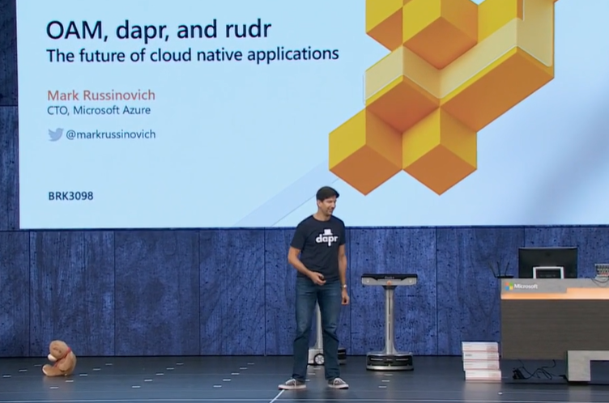
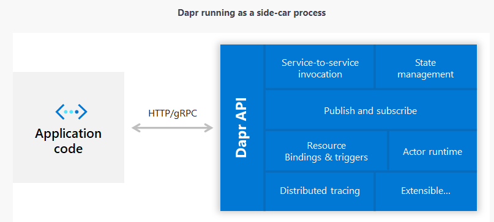

## Why a talk about Dapr?

- It's a new topic ([announced October 2019](https://cloudblogs.microsoft.com/opensource/2019/10/16/announcing-dapr-open-source-project-build-microservice-applications/))
- It's a hot topic:

**Mark Russinovich** (and a teddy bear) talked about it!
- [at Ignite 2019](https://azure.microsoft.com/en-gb/resources/videos/ignite-2019-mark-russinovich-presents-the-future-of-cloud-native-applications-with-oam-and-dapr/) (p.s. I've not watched this yet...!):



- and to Hanselman (I did listen to this...)
    - ["Dapr Distributed Application Runtime with Azure CTO Mark Russinovich" on Hanselminutes](https://hanselminutes.com/718/dapr-distributed-application-runtime-with-azure-cto-mark-russinovich)

    


At the Partner Cloud Architect Bootcamp **Brendan Burns** hinted that Kubernetes (and specifically Microsoft's own Kubernetes offering - AKS) "need to get alot easier to use".

I've been keeping an eye out for evidence of this prediction, and this seemed like it might be another step along that path...

I havent had time to look at `OAM` and `rudr` yet!

## What is Dapr?

> *"An event-driven, portable runtime for building microservices on cloud and edge."*

[Dapr concepts](https://github.com/dapr/docs/tree/master/concepts)

### event-driven

Resource bindings and triggers (think Azure Functions)

### portable

- run locally (processes)
- run on kubernetes (pods and containers)
- Edge (IoT etc.)

### for building microservices

- light-touch architecture - un-intrusive to use in legacy applications (sidecar pattern)
- building blocks model
    - cross-cutting concerns (service invocation, resilience, state persistence, messaging, actor model, )
    - incremental adoption
- works with *any programming language* - on *any cloud or edge*
- provides consistency and portability, via standard open APIs
- is an open source and vendor neutral project.

## Sidecar Architecture

not requiring the application code to include any Dapr runtime code



# Demo

[Dapr samples](https://github.com/dapr/samples/blob/master/README.md)

[Set up AKS cluster](setup-aks.sh)

[Deploy hello-kubernetes sample](2.hello-kubernetes/deploy/deploy.sh)

# Other Topics

Show [scoop](https://rohancragg.co.uk/misc/scoop/)

```
scoop status
scoop bucket list

scoop update postman

```
